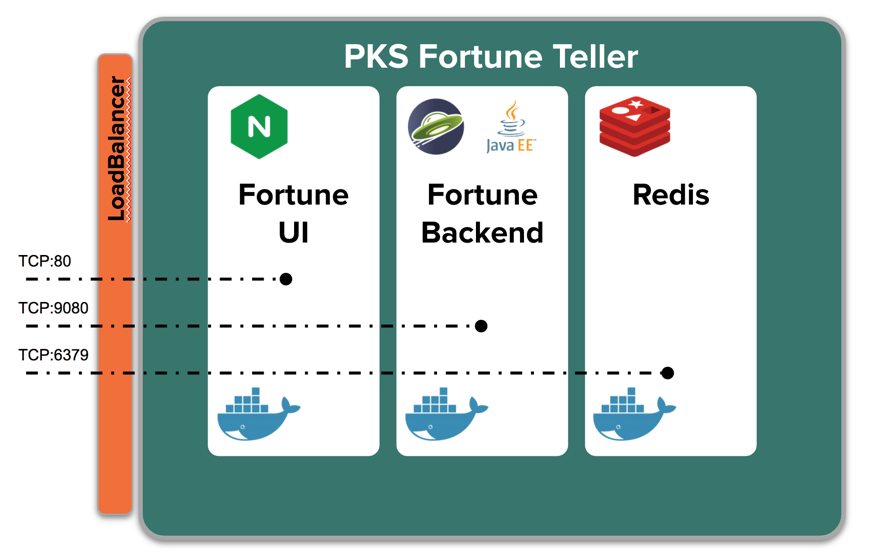
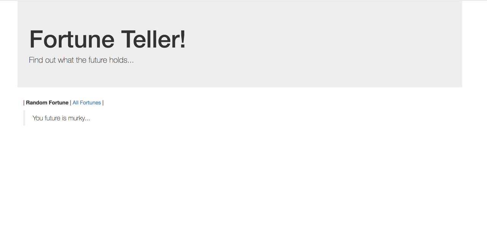
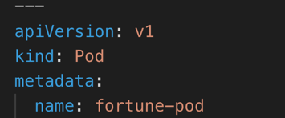
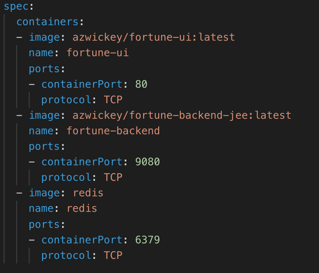
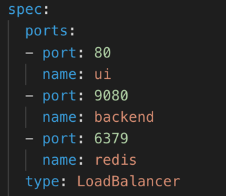
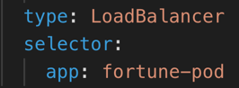
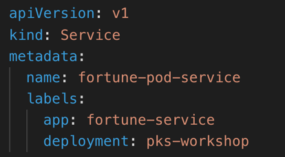
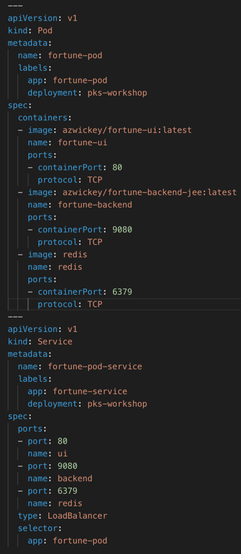

## Kubernetes Declarative Configuration

Lets deploy the initial version of our demo application, PKS Fortune Teller.  This is a 3 tier application that contains a HTML/JavaScript app served from Nginx, a Spring Boot REST backend, and a Redis persistent data service.





### Examine declarative resource definition for demo application

1. Download the YAML file [here](fortune-pod.yml) and examine its contents in a text editor or IDE like VS Code. This file will be used to create the declarative configuration of the API objects required to deploy the demo application in a single pod.

1. The following denotes the resource declaration for a Pod API object:



1. The following adds a labels attribute to the metadata section of the resource configuration.  We have added an "app" and "deployment" label.  Notice that this is a child of the metadata attribute


1. Next, on the line beneath the _metadata_ definition is the `spec` for the 3 containers within our application.  Notice that  _containers_ is an array.  Each container defines the image, a name for the container within the pod, and a list of ports to be exposed from the container.




### Examine the service resource for routing traffic

1. Within the same yml file, notice another yml directive separated by 3 dashes ('---').  Within this new directive  the resource definition for a Service API object is defined as follows:


2. Next, on the line beneath the _metadata_ definition is the `spec` for the ports that need to exposed by our application.  The _ports_ attribute is an array.  Additionally, the service spec requires a service _type_.  We use the type *LoadBalancer* since we want to expose our application externally.




3. We must specify resource selector in order to determine which pods to link to the service.  This is where the label we applied to the pod resource object comes into play.  We specify a selector to select and pod that has the label *app: fortune*.  This selector is  the last attribute of the Service _spec_, right under the type attribute.




4. As with the pod API object, we include a _labels_ attribute to the metadata section of the service resource configuration.  We use the same labels "app" and "deployment", but use a different value for the app label to differentiate our pod and our service.




5. The completed configuration for the Pod and Service API objects should as shown below. Copy the contents of the file into a named fortune-pod.yml within the terminal you are are using.




### Deploy the demo application
1. Open a command window and *watch* the kubectl _get_ command.  Use the labels we attached to the resources earlier as filters so only the resources associated with the demo application appear.  Initially no resources will be found.
```shell
 watch kubectl get all -l deployment=pks-workshop --show-labels
```

1. Deploy the demo application to your Kubernetes cluster using the kubectl _create_ command, using the declarative configuration you just reviewed (you can use the yml we pre-created for you [here](fortune-pod.yml)
)
```shell
$ kubectl create -f fortune-pod.yml
service "fortune-service" created
pod "fortune" created
```

1. Inspect the output of your watch of the kubectl get command.  You'll see the newly deployed Pod and Service appear and startup.  Take note of the external IP address that is assigned to the fortune-service as that can be used to access the application in the next step.
```
  Every 2.0s: kubectl get all -l deployment=pks-workshop --show-labels                                                                               Wed Dec 17 09:11:31 2018

  NAME         READY     STATUS    RESTARTS   AGE       LABELS
  po/fortune   3/3       Running   0          2m        app=fortune,deployment=pks-workshop

  NAME                  TYPE           CLUSTER-IP       EXTERNAL-IP    PORT(S)                                      AGE       LABELS
  svc/fortune-service   LoadBalancer   10.100.200.249   10.195.82.166   80:30828/TCP,9080:30049/TCP,6379:31123/TCP   2m        app=fortune-service,deployment=pks-workshop
```

1. Open a web browser and access the application using the external IP on port 80 (e.g. http://10.195.82.166/). You will likely not be able to access the external IP directly from your workstation. So you can verify availability of the service using a tool like `curl`, like so: 

```
$ curl http://10.195.82.166
<DOCTYPE html>
    <html lang="en">
    <head>
        <title>Fortune Teller</title>
        <script src="//ajax.googleapis.com/ajax/libs/jquery/1.10.2/jquery.min.js"></script>
        <link href="//netdna.bootstrapcdn.com/bootstrap/3.0.0/css/bootstrap.min.css" rel="stylesheet"/>
        <script src="//netdna.bootstrapcdn.com/bootstrap/3.0.0/js/bootstrap.min.js"></script>
        <script src="app.js"></script>
    </head>
    <body onload="loadOne()">
      <div class="jumbotron container">
          <h1>Fortune Teller!</h1>
          <p>Find out what the future holds...</p>
      </div>
      <div class="container">
          <p>| <b>Random Fortune</b> | <a href="all-fortunes.html">All Fortunes</a> |</p>
        <blockquote id="fortune" />
      </div>
    </body>
    </html>
```


1. Additionally, you may recall we exposed a service on port 9080.  This represents the backend Java JEE application exposing a JAX-RS service endpoint.  Access the /fortune-backend-jee/app/fortune/all endpoint using the external IP address but specify port 9080 this time.  E.G. http://10.195.82.166:9080/fortune-backend-jee/app/fortune/all  This can be done using a tool such as `curl`:
```shell
$ curl  http://10.195.82.166:9080/fortune-backend-jee/app/fortune/all
[]
```

1. Right now we have no fortune (!) because the Redis backend doesn't have any fortunes loaded.  Let us put a few fortunes using `curl`.  Run this multiple times with different fortunes.
```shell
$ curl -X PUT -H "Content-Type: application/json" -d '{"text":"HII is going to hit $600"}' http://10.195.82.166:9080/fortune-backend-jee/app/fortune
{"id":2,"text":"HII is going to hit $600"}
```

1. Verify the fortunes have been stored in Redis by hitting the /all and /random URLs as follows:
```
$ curl  http://10.195.82.166:9080/fortune-backend-jee/app/fortune/all | jq
  % Total    % Received % Xferd  Average Speed   Time    Time     Time  Current
                                 Dload  Upload   Total   Spent    Left  Speed
100    88  100    88    0     0   4888      0 --:--:-- --:--:-- --:--:--  4888
[
  {
    "id": 1,
    "text": "Its going to be all sunny"
  },
  {
    "id": 2,
    "text": "HII is going to hit $600"
  }
]
```

Notice piping the output of curl to `jq` generates a prettier output. Run the following multiple times to see different fortunes returned:

```
$ curl  http://10.195.82.166:9080/fortune-backend-jee/app/fortune/random | jq
  % Total    % Received % Xferd  Average Speed   Time    Time     Time  Current
                                 Dload  Upload   Total   Spent    Left  Speed
100    42  100    42    0     0   1166      0 --:--:-- --:--:-- --:--:--  1166
{
  "id": 2,
  "text": "HII is going to hit $600"
}
```

1. Lastly, if the Redis Client CLI is installed on your machine attempt to access Redis using the service port exposed for Redis: 6379
```shell
$ redis-cli -h 10.195.82.166
10.195.82.166:6379> ping
PONG
10.195.82.166:6379> exit
```