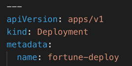
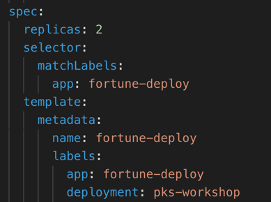

# Change Fortune Application to a Kubernetes Deployment
This exercise builds upon the [Kubernetes Declarative Configuration](k8s-pod-declarative.en.md) exercise. We will pull the fortune teller frontend and backend apps out and deploy them as a separate `Kubernetes Deployment` while still connecting to the Redis we deployed in [Fortune Pod](fortune-pod.yml)

1. Download the YAML file [here](fortune-deploy.yml) and examine its contents in a text editor or IDE like VS Code. This file will be used to deploy the fortune apps as a _Deployment_, a Kubernetes primitive for highly available and scalable applications. As before, the definition begins with the api version, kind, and basic metadata.




1. Next, notice the beginning of the spec for the _Deployment_.  This will include the number of replicas, a label selector, and the declaration of the the template and metadata for the spec:




1. Continue on to the Deployment template that is defined by the *spec for the containers* that are part of the deployment template.  Refer to the `spec` section of the completed [yaml](fortune-deploy.yml)


1. Lastly, we add an environment variable that defines how the backend will connect to the redis server.  This is required since the backend app and redis are no longer colocated in the same pod (and referenceable via localhost).  This value references the DNS entry created in kube-DNS for the original fortune-pod-service created during the initial pod deployment. Generally the DNS for service is like `<service name>.<namespace>.svc.cluster.local`. *Make sure to replace with your namespace.*


## Create a Service Resource for Routing Traffic to the Deployment 
1. Within the same yml file, create a loadBalancer service for the deployment like what we did in the previous lab. The completed configuration for the API objects should appear as [this](fortune-deploy.yml). Make sure updating the value of environment variable `REDIS_HOST` with *your namespace* before applying changes.

2. Deploy the API objects to your Kubernetes cluster using the kubectl _create_ command, using the declarative configuration you just created:
```shell
$ kubectl create -f fortune-deploy.yml
service "fortune-deploy-service" created
deployment "fortune-deploy" created
```

3. Inspect the output of the kubectl get command.  You'll see the newly deployed Deployment, associated Pods, and Service appear and startup.  Take note of the external IP address that is assigned to the new fortune-deploy-service as that can be used to access the application.
```shell
$ kubectl get all -l deployment=pks-workshop
NAME                                  READY   STATUS    RESTARTS   AGE
pod/fortune-deploy-7c98869fbd-scvq2   2/2     Running   0          29m
pod/fortune-deploy-7c98869fbd-t4g8x   2/2     Running   0          29m
pod/fortune-pod                       3/3     Running   0          120m

NAME                             TYPE           CLUSTER-IP       EXTERNAL-IP                  PORT(S)                                      AGE
service/fortune-deploy-service   LoadBalancer   10.100.200.228   10.195.15.143   80:30586/TCP,9080:30224/TCP                  5m21s
service/fortune-pod-service      LoadBalancer   10.100.200.148   10.195.15.142   80:31719/TCP,9080:31217/TCP,6379:32012/TCP   120m

NAME                             DESIRED   CURRENT   UP-TO-DATE   AVAILABLE   AGE
deployment.apps/fortune-deploy   2         2         2            2           29m

NAME                                        DESIRED   CURRENT   READY   AGE
replicaset.apps/fortune-deploy-7c98869fbd   2         2         2       29m
```

4. Test the app with the new IP from a web browser or curl just as before. E.G. http://10.195.15.143/all-fortunes.html. You should be able to see the existing fortunes you inserted in the last lab.

# Operate on Fortune Deployment
## Scale the deployment 
```
$ kubectl scale deployment.apps/fortune-deploy --replicas=5
deployment.apps/fortune-deploy scaled
```
## Update and rollout the deployment
1. Update the deployment definition within `fortune-deploy.yml` with an addition to the container spec adding a resource request and limit section.  We'll request 1GB of memory and .5 cpu and limit our container so as to not use more than 2GBs of memory and 1 cpu.  As with the env var, make sure this value is part of the first element in the *containers* array in the data structure:
```yaml
resources:
  requests:
    memory: "1G"
    cpu: "0.5"
  limits:
    memory: "2G"
    cpu: "1.0"
```

2. Uncomment the section above from [here](fortune-deploy.yml). 
 
_* NOTE: A Deployment’s rollout is triggered if and only if the Deployment’s pod template (that is, .spec.template) is changed, for example if the labels or container images of the template are updated. Other updates, such as scaling the Deployment, do not trigger a rollout._

3. The deployment API object already exists within the Kubernetes cluster.  Use the kubectl _apply_ command to update the existing objects, passing in the yml description of the api objects:
```shell
$ kubectl apply -f fortune-deploy.yml
service/fortune-deploy-service unchanged
deployment.apps/fortune-deploy configured
```

4. Watch the updates being rolled out to pods
```shell
$ kubectl rollout status deployment.apps/fortune-deploy
Waiting for deployment "fortune-deploy" rollout to finish: 1 out of 2 new replicas have been updated...
Waiting for deployment "fortune-deploy" rollout to finish: 1 out of 2 new replicas have been updated...
Waiting for deployment "fortune-deploy" rollout to finish: 1 out of 2 new replicas have been updated...
Waiting for deployment "fortune-deploy" rollout to finish: 1 old replicas are pending termination...
Waiting for deployment "fortune-deploy" rollout to finish: 1 old replicas are pending termination...
deployment "fortune-deploy" successfully rolled out
```

  Kubernetes will create 2 new pods governed by the new resource locations and destroy the old pods.  This can be seen by viewing the age of the fortune-backend pods displayed in the output from our watch command on kubectl, which now indicate they are under 1 min old:

```shell
$ kubectl get all -l deployment=pks-workshop
NAME                                  READY   STATUS    RESTARTS   AGE
pod/fortune-deploy-5fbb98594c-6cns4   2/2     Running   0          20s
pod/fortune-deploy-5fbb98594c-97qdz   2/2     Running   0          16s
pod/fortune-pod                       3/3     Running   0          133m

NAME                             TYPE           CLUSTER-IP       EXTERNAL-IP                  PORT(S)                                      AGE
service/fortune-deploy-service   LoadBalancer   10.100.200.228   10.195.15.143,100.64.16.13   80:30586/TCP,9080:30224/TCP                  18m
service/fortune-pod-service      LoadBalancer   10.100.200.148   10.195.15.142,100.64.16.13   80:31719/TCP,9080:31217/TCP,6379:32012/TCP   133m

NAME                             DESIRED   CURRENT   UP-TO-DATE   AVAILABLE   AGE
deployment.apps/fortune-deploy   2         2         2            2           42m

NAME                                        DESIRED   CURRENT   READY   AGE
replicaset.apps/fortune-deploy-5fbb98594c   2         2         2       21s
replicaset.apps/fortune-deploy-7c98869fbd   0         0         0       42m
```
